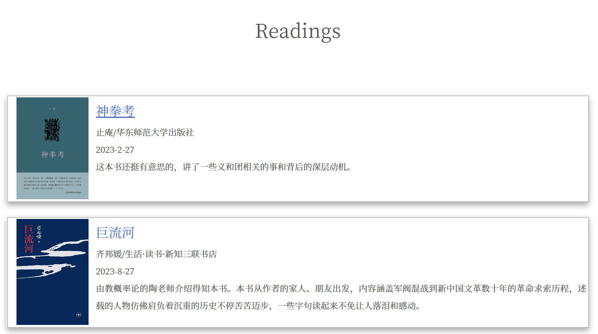

### Hexo-book-card

在hexo page内生成含post link的读书卡片(也可用于电影等等类别的卡片)

> 如果需要在post中使用可以自行修改本插件的index.js

#### 使用步骤

- 使用`hexo new page ...`创建一个新的页面

- 在`index.md`中以如下格式使用本插件

  

  其中pic_path可以是网络上的图片或与index.md同级别目录下相对路径
  
- 需要为卡片标题加上到某个post的内部链接，可以用 {=book_name=}的格式

#### 举例

```
 {=神拳考=}


```



#### 安装

```
npm install git://github.com/Unparalleled-Calvin/hexo-book-card#master
```
